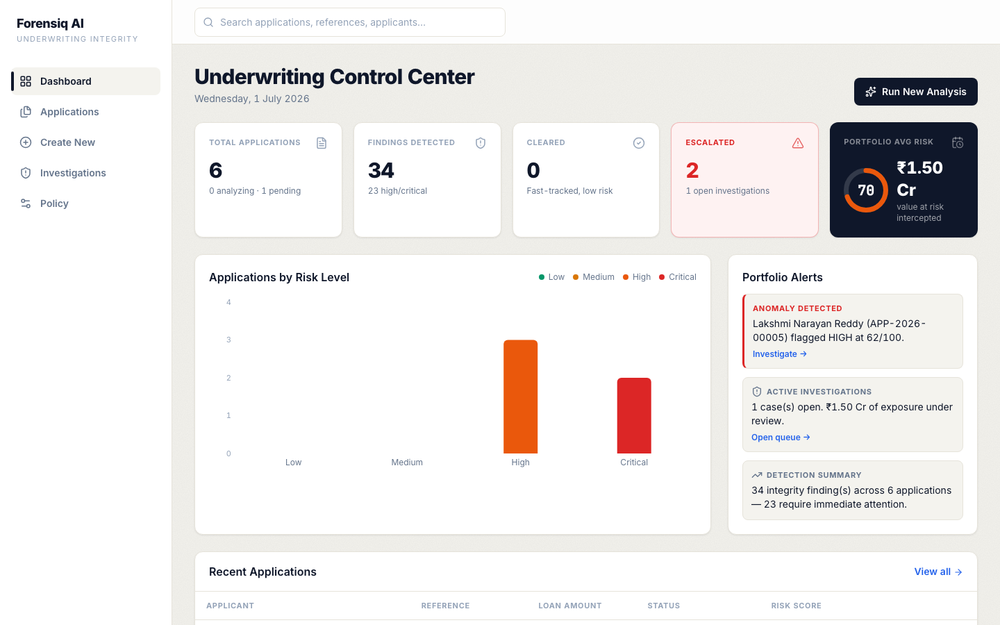
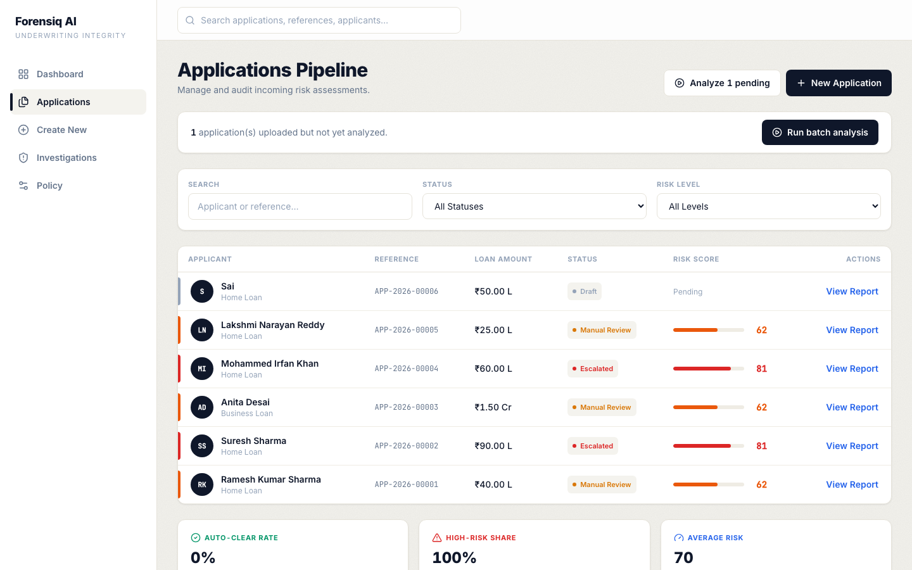
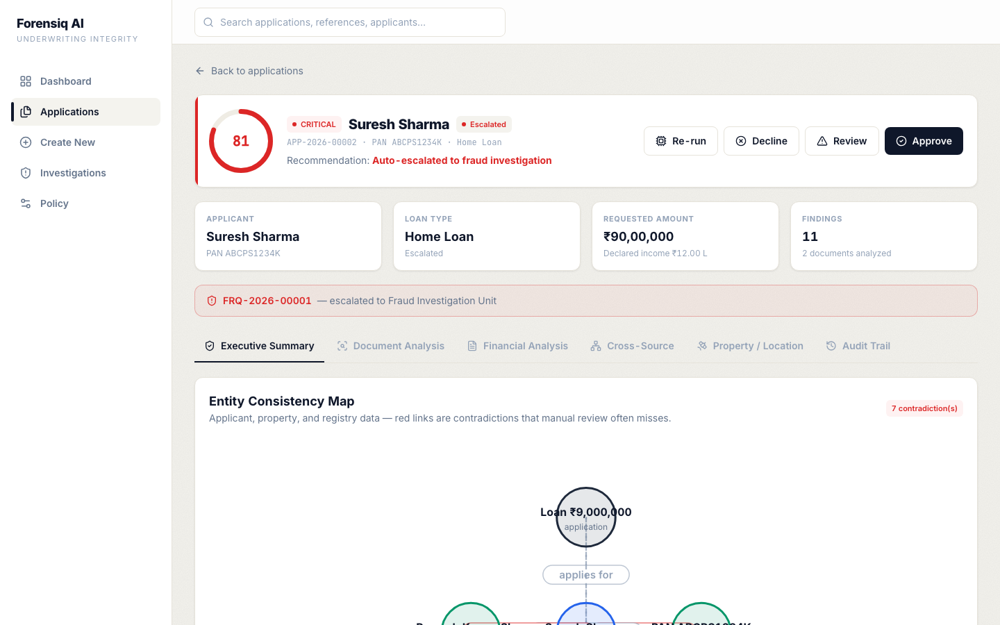
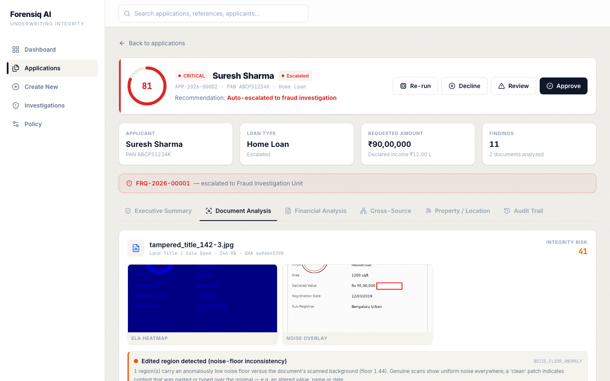
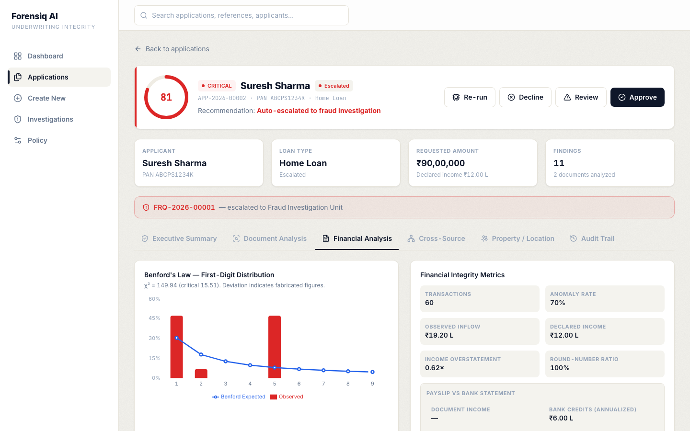
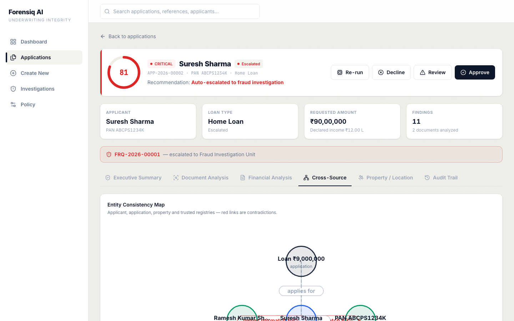

# Forensiq AI

**Catch loan fraud that single-document checks miss.**

Forensiq AI is a prototype underwriting intelligence layer for Canara Bank's **SuRaksha Cyber Hackathon 2.0** (Theme 1: real-time anomaly detection). It reads the documents a borrower submits, checks them against registries, bank activity, and satellite land-use data, then shows **where the story breaks** with evidence you can defend in an audit.

**Live demo:** [forensiq-ai.onrender.com](https://forensiq-ai.onrender.com)

## Screenshots

**Dashboard** — portfolio risk, contradiction counts, and applications needing attention.



**Applications** — filter and open any demo case.



**Executive Summary** — risk narrative, module scores, and the consistency knowledge graph on a fraud case (Suresh Sharma).



**Document Analysis** — forensic artifacts including original document vs Error-Level Analysis (ELA).



**Financial Analysis** — Benford distribution and income vs bank inflow.



**Cross-Source** — registry reconciliation and contradiction findings.



---

## Try it in two minutes

1. Open the [live app](https://forensiq-ai.onrender.com) (or run locally with `./start.sh`).
2. Go to **Applications**.
3. Open **Suresh Sharma** to see a finished fraud case, or **Lakshmi Narayan Reddy** and click **Run Forensiq Analysis** to watch the pipeline live.
4. On the application page, check:
   - **Overview** — risk score, narrative, and the **Consistency Knowledge Graph** (red edges = sources disagree).
   - **Forensics** — **Original** vs **Error-Level Analysis (ELA)** side by side on tampered images.
   - **Financial** — Benford chart and income vs bank inflow.
   - **GIS** — claimed land use vs what satellite-style analysis shows.

On first deploy, five demo applications are seeded automatically. Four are already analyzed; one is left for a live run.

---

## The problem we solve

Underwriters get a stack of PDFs and scans. Each file can look fine on its own. Fraud shows up when you compare them:

| What the borrower says | What another source says |
|------------------------|--------------------------|
| "I own this property" | Land registry lists a different owner |
| "Residential building" | Satellite analysis shows vacant land |
| "₹12L annual income" | Bank credits do not support it |
| "Original title deed" | ELA shows a pasted-over value region |

Forensiq AI automates that cross-check and surfaces contradictions with confidence scores and artifacts, not a black-box number.

---

## Demo scenarios

| Applicant | What is wrong | Expected result |
|-----------|---------------|-----------------|
| Ramesh Kumar Sharma | Clean, consistent pack | Low risk, auto-clear |
| Suresh Sharma | Forged deed, owner mismatch, fabricated statement | Critical, escalated |
| Anita Desai | Tampered income cert, Benford violation | High, manual review |
| Mohammed Irfan Khan | Vacant land vs "residential", active litigation | Critical, escalated |
| Lakshmi Narayan Reddy | Encumbered agricultural land | Run analysis live |

Sample files live under `backend/app/data/samples/` if you want to upload your own application.

---

## What is under the hood

Six modules run in sequence when you click **Analyze**:

1. **Document forensics** — tampering on images and PDFs (noise-floor analysis, ELA heatmaps, metadata checks, OCR field extraction).
2. **Financial integrity** — Benford's Law on amounts, Isolation Forest on transactions, declared income vs bank inflow.
3. **Cross-source verification** — PAN, ownership, encumbrance, value and area vs mock land and identity registries.
4. **GIS / satellite** — claimed use vs observed built-up / vegetation from offline observation data.
5. **Risk intelligence** — weighted score, plain-English narrative, contradiction list, unified knowledge graph.
6. **Escalation** — auto-clear, manual review, or open a fraud case with audit trail.

Progress streams over WebSockets so the UI updates stage by stage.

---

## What is real vs simulated

**Real (runs locally, no LLM):**

- Error-Level Analysis and noise-floor detection on images
- PDF structural checks (incremental updates, producer metadata)
- Tesseract OCR and regex field extraction
- Benford's Law and Isolation Forest on transaction CSVs
- Rule-based cross-source reconciliation and risk scoring

**Simulated for the hackathon prototype:**

- Land registry, identity registry, and GIS observations (`backend/app/data/registries/`)
- Geocoding uses bundled pincode centroids, not a live maps API

The integration points are the same shape as production: swap the JSON registries for CERSAI, state land records, or Bhuvan when APIs are available.

**No large language model** is used. Explanations come from structured findings and templates.

---

## Run locally

**You need:** Python 3.13, Node 18+, Tesseract (`brew install tesseract` on macOS).

```bash
git clone https://github.com/chxmq/forensiq-ai.git
cd forensiq-ai
./start.sh
```

Then open:

- App: **http://localhost:5173**
- API docs: **http://127.0.0.1:8000/docs**

`start.sh` creates the virtualenv, installs dependencies, seeds demo data, and starts backend + frontend.

### Manual start

```bash
# Terminal 1 — backend
cd backend
python3.13 -m venv .venv
./.venv/bin/pip install -r requirements.txt
./.venv/bin/python -m scripts.seed
./.venv/bin/python -m uvicorn app.main:app --reload

# Terminal 2 — frontend
cd frontend
npm install
npm run dev
```

---

## Deploy

Single Docker image: API, WebSockets, artifacts, and the React UI on one port.

```bash
docker build -t forensiq-ai .
docker run -p 8000:8000 forensiq-ai
# → http://localhost:8000
```

**Render (current production):** connect the GitHub repo; `render.yaml` defines the service. Free tier sleeps after idle (~50s wake). Data is ephemeral unless you add a persistent disk.

| Variable | Default | Purpose |
|----------|---------|---------|
| `PORT` | `8000` | HTTP port |
| `FORENSIQ_ENVIRONMENT` | `development` | Set `production` when deployed |
| `FORENSIQ_STATIC_DIR` | set in Dockerfile | Built frontend assets |

Tunable weights and thresholds: `backend/app/core/config.py` (env prefix `FORENSIQ_`).

---

## Project layout

```
backend/app/
  api/              REST + WebSocket routes
  services/
    forensics/      image & PDF analysis, OCR
    financial/      Benford, Isolation Forest, income checks
    verification/   registry cross-checks
    gis/            land-use validation
    risk/           scoring + consistency knowledge graph
    pipeline/       analysis orchestrator
  data/             mock registries + sample documents
frontend/src/
  pages/            dashboard, applications, cases, settings
  components/       knowledge graph, maps, charts
```

---

## Offline requirement

The app is built to run **without internet** after install: no external LLMs, no CDN assets, no live map tiles. Forensics and ML run on the server; GIS uses bundled observation data instead of streaming satellite tiles.

---

## License and context

Built for **SuRaksha Cyber Hackathon 2.0**, Canara Bank, Theme 1 — intelligent verification during loan underwriting.

Repository: [github.com/chxmq/forensiq-ai](https://github.com/chxmq/forensiq-ai)
